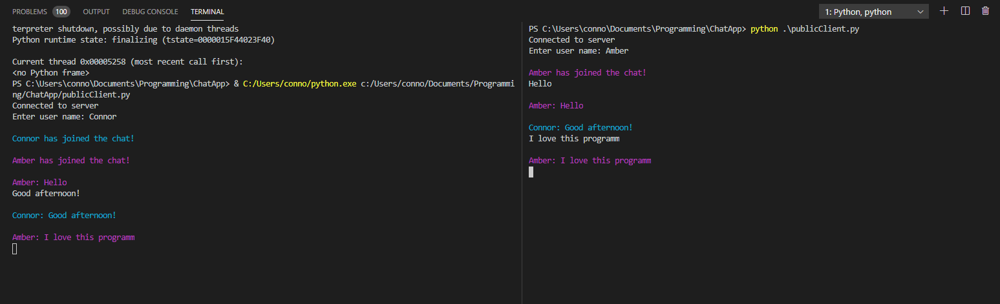
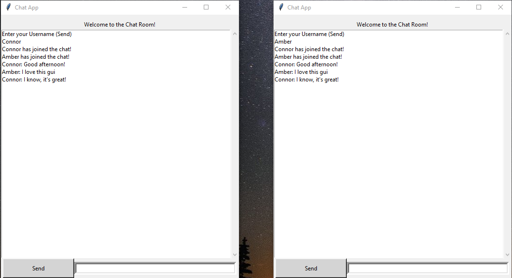

# ChatApp
A python based chat application that lets you communicate through the terminal and a graphical user interface. This project allows you to chat locally or from anywhere by connecting to our ubuntu server. 

## Logic
As a user sends a message, it goes to the server. Once the server recieves the message it distributes it out to the other clients. This type of logic forms a usable local and wireless chat system. To design the graphical interface, I used a Python library known as Tkinter. The main learning from this projected included learning socket programming and gui development through Tkinter.

